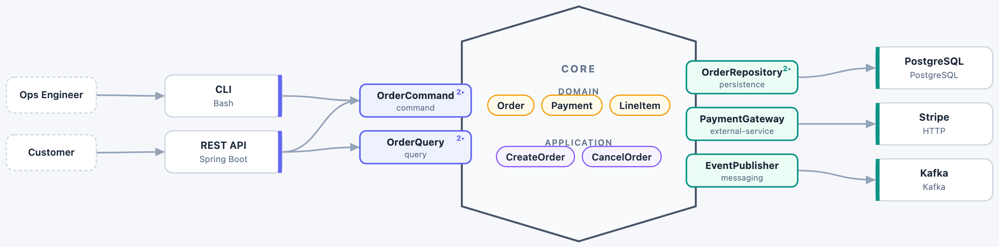

# hexarch

A **domain-specific language for Hexagonal Architecture (Ports & Adapters)**, a
CLI that renders it to an interactive diagram in your browser, and an agent-skill
that teaches AI agents to author specs.

Describe a system's architecture in a small YAML DSL - its core, the ports on
its boundary, the adapters that plug in, the actors that drive it - and let
`hex-render` draw it. The spec is the source of truth; the renderer owns every
visual decision (placement, docking, arrows, styling). The spec lives in your
repo and depends on nothing.



```bash
hex-render docs/order-service.hexarch.yaml
```

That parses and validates the spec, writes a **self-contained HTML** file (the
whole viewer inlined, no server, works offline), and opens it in your browser.

---

## Install

hexarch ships two things that belong together - the **`hex-render` renderer**
and the **`hexarch` agent-skill** (which teaches AI agents to author specs and
render them). One installer sets up both:

```bash
curl -fsSL https://raw.githubusercontent.com/a-grasso/hexarch/main/install.sh | bash
```

That clones/updates the repo, puts `hex-render` on your `PATH`
(`~/.local/bin`), and symlinks the skill into `~/.claude/skills/hexarch`. It
builds the renderer from source when [Bun](https://bun.sh) + Node are present
(symlinked, so a rebuild updates it), otherwise downloads the prebuilt binary
for your platform. Idempotent - re-run to update.

```bash
# scope options
./install.sh --project ~/repo   # skill into one project's .claude/skills (gitignored)
./install.sh --skill-only       # skill only
./install.sh --cli-only         # renderer only
```

From a local checkout, `just` wraps the same steps:

```bash
git clone https://github.com/a-grasso/hexarch && cd hexarch
just build      # -> dist/hex-render
just link       # symlink -> ~/.local/bin (rebuild updates it)
```

**Optional - Homebrew** (renderer only, no skill):

```bash
brew install a-grasso/tap/hex-render
```

> Keep **one** `hex-render` on `PATH`: the installer *or* brew, not both.

---

## Usage

```
hex-render [options] <spec.hexarch.yaml> [more specs...]

  -f, --file <path>    a spec file (repeatable; positionals work too)
  -d, --dir <path>     render every *.yaml / *.hexarch.yaml in a directory
  -o, --out <path>     write the self-contained HTML here (implies --no-open)
  -s, --serve          live server that reloads when the spec changes
  -p, --port <n>       server port for --serve (default 5179)
  -t, --theme <t>      force initial theme: light | dark
      --no-open        don't open a browser
  -h, --help / -v, --version
```

```bash
hex-render order.hexarch.yaml               # render + open
hex-render -f order.yaml -o order.html      # save a shareable HTML, don't open
hex-render --serve order.yaml               # live-reload while you edit
hex-render --dir docs/                      # a picker over every spec in docs/
```

- **`--out`** gives you one HTML file to commit, email, or drop in a wiki - it
  carries the whole interactive viewer inside it.
- **`--serve`** re-reads the file on every request and reloads the browser on
  save - the tight authoring loop.

---

## The DSL in 20 seconds

```yaml
architecture:
  name: Order Service
actors:
  - { name: Customer, drives: [REST API] }
core:
  domain: [Order, Payment]
  application: { services: [CreateOrder, CancelOrder] }
ports:
  inbound:
    - name: OrderCommand
      type: command
      operations: [createOrder, cancelOrder]
  outbound:
    - name: OrderRepository
      type: persistence
adapters:
  primary:
    - { name: REST API, technology: Spring Boot, implements: [OrderCommand] }
  secondary:
    - { name: PostgreSQL, technology: PostgreSQL, implements: [OrderRepository] }
```

Full reference and validation rules: **[`dsl/SPEC.md`](dsl/SPEC.md)**. Runnable
examples in **[`examples/`](examples/)**.

---

## Interactions

- **Hover a port** - popover with its type, description and operations; the rest
  of the diagram dims to just what connects to it.
- **Click a section header** (Domain / Application) - collapse it.
- **Wheel to zoom, drag to pan**; theme toggle in the toolbar.

---

## Develop

```bash
just setup                       # install workspace deps
just dev                         # dev server on :5179 (bundled examples)
just dev DIR=/path/to/your/specs # point it at a project's specs (hot-reload)
just render examples/order-service.yaml   # run the CLI from source
just check                       # typecheck viewer + CLI
```

### How it fits together

| path | what |
|------|------|
| [`dsl/SPEC.md`](dsl/SPEC.md) | the DSL specification |
| [`core/`](core/) | shared semantic model + YAML parser/validator (`@hexarch/core`) |
| [`viewer/`](viewer/) | Vite/React/TS viewer; real text measurement, SVG rendering, interactions |
| [`cli/`](cli/) | the `hex-render` CLI (Bun/TS); embeds the built viewer |
| [`skills/hexarch/`](skills/hexarch/) | the `hexarch` agent-skill (`SKILL.md` + `reference/` symlinked to the spec/examples) |
| [`examples/`](examples/) | example specs |
| [`install.sh`](install.sh) | unified installer (skill + renderer) |
| [`scripts/`](scripts/), [`.github/`](.github/) | formula renderer + release workflow |

The viewer builds to a single inlined HTML (`vite-plugin-singlefile`); a
generated module bakes that HTML into the CLI, and `bun build --compile`
produces the standalone `hex-render` binary. The layout is a pure function of
the parsed model plus measured text, so the same code drives the live viewer and
any static output.

## For AI agents

Installing the skill teaches AI agents (Claude Code) to author, adapt, and lint
hexarch specs for a project and to render them with `hex-render`. It auto-loads
when you ask about hexagonal architecture or a `*.hexarch.yaml`. See
[`skills/hexarch/SKILL.md`](skills/hexarch/SKILL.md).

## Distribution

The primary channel is **`install.sh`** - one self-bootstrapping script that
installs the skill and the renderer together, so they stay version-matched
(clone-or-update + symlink the skill + build-or-download the CLI).

Tagged releases feed the optional brew channel and the prebuilt-download path:
`just release X.Y.Z` pushes a `v*` tag, and
[`.github/workflows/release.yml`](.github/workflows/release.yml) cross-compiles
the binary for macOS/Linux × arm64/x64 with Bun, publishes a GitHub release with
per-arch `.tar.xz`, and regenerates `Formula/hex-render.rb` in
**[a-grasso/homebrew-tap](https://github.com/a-grasso/homebrew-tap)** (auth via
`HOMEBREW_TAP_TOKEN`). The repo must be **public** for `brew`/`curl` to fetch
release assets.

## License

MIT - see [LICENSE](LICENSE).
